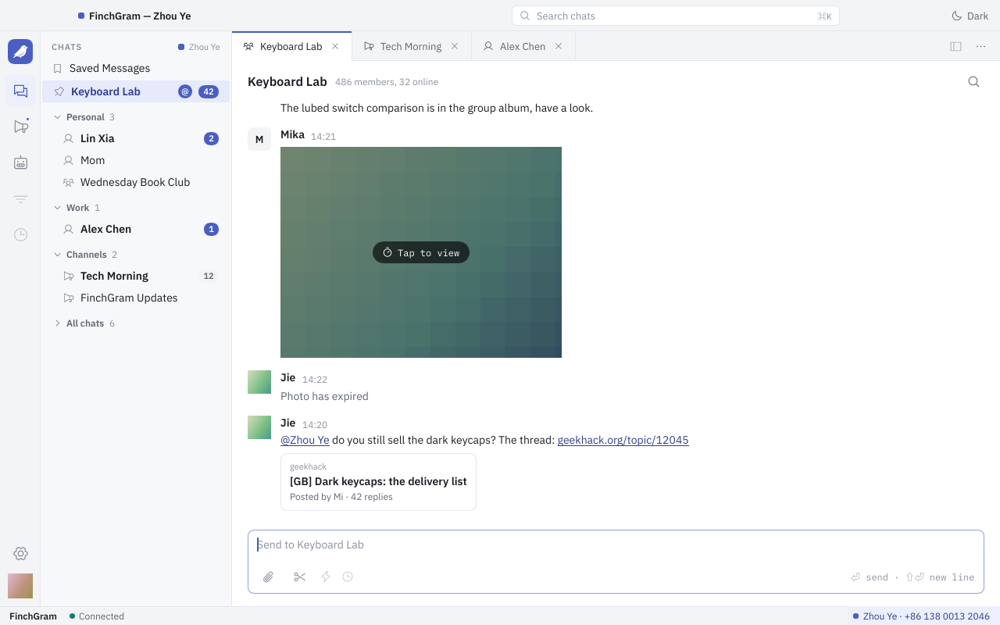
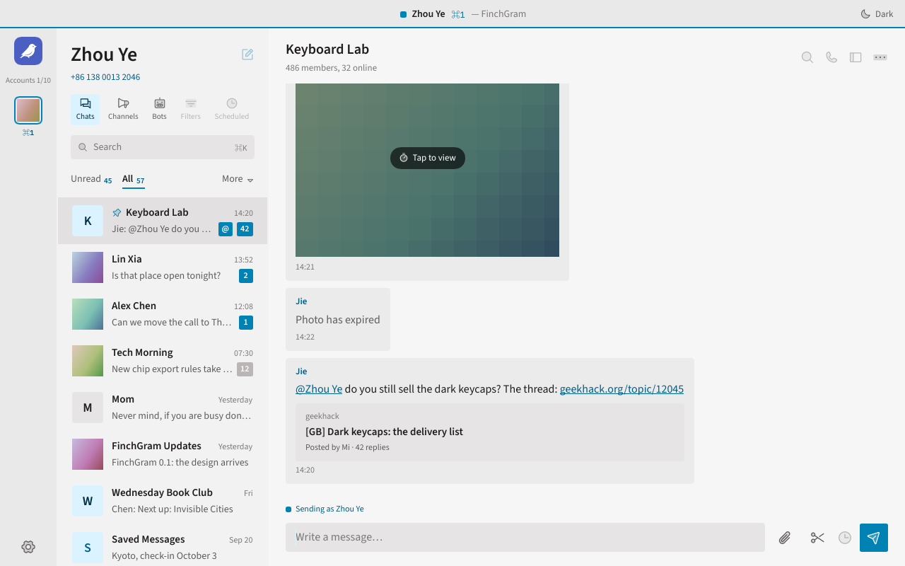
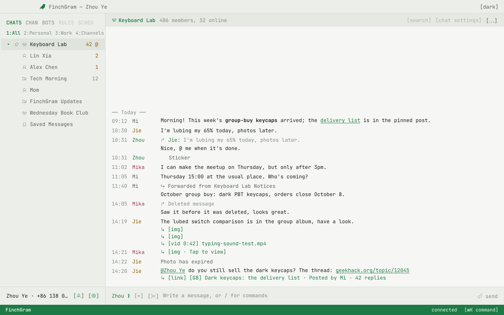
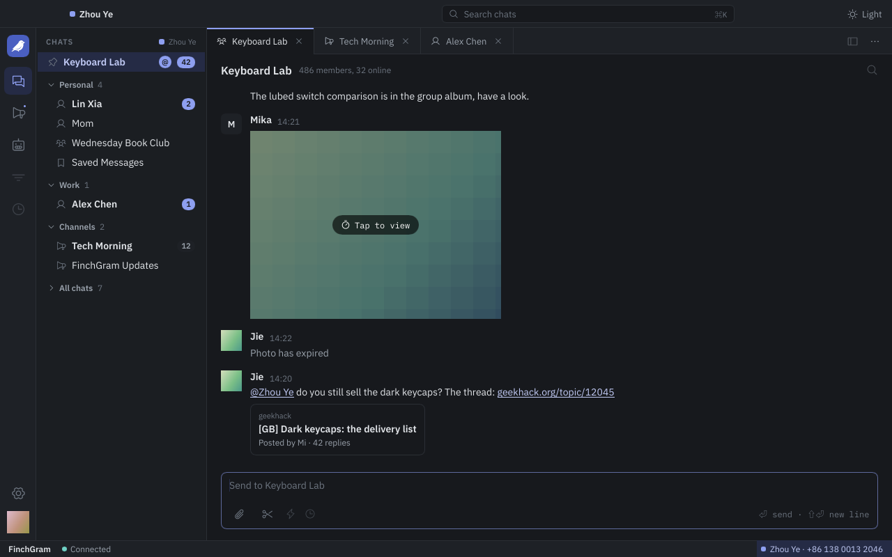
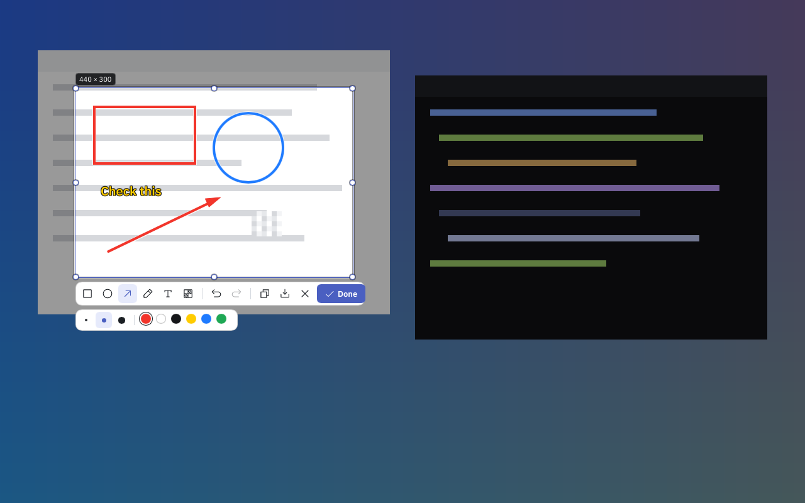
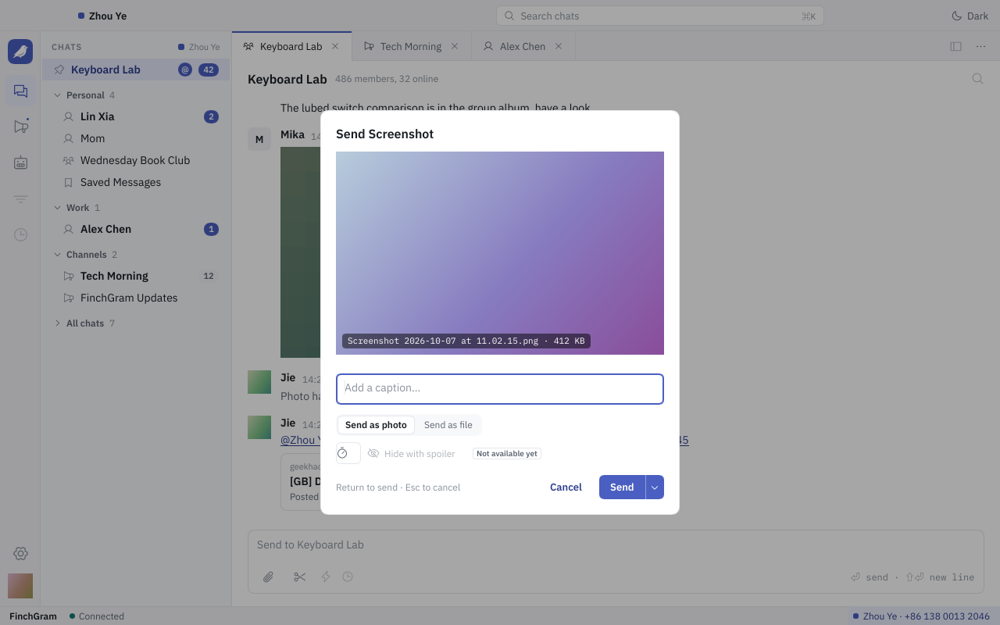

# FinchGram

**English** · [简体中文](readme/zh-Hans.md) · [繁體中文](readme/zh-Hant.md) · [Español](readme/es.md) · [Português](readme/pt.md) · [Deutsch](readme/de.md) · [Français](readme/fr.md) · [Русский](readme/ru.md) · [日本語](readme/ja.md) · [한국어](readme/ko.md) · [العربية](readme/ar.md)

<p align="center"></p>

**A Telegram desktop client with a media center, in Rust and [Slint](https://slint.dev).** Open source
under the GPL-3.0. macOS on Apple silicon today; Windows and Linux later.

FinchGram talks to Telegram through [TDLib](https://core.telegram.org/tdlib), Telegram's own library,
and keeps to the [Telegram API terms](https://core.telegram.org/api/terms). It is an unofficial
client, not made by Telegram.

<p align="center"></p>

## What it does

- **Chats.** Log in with your phone number, the code and your two-step password, or by scanning a
  QR code; sign up for a new account. The chat list with Telegram's folders, pinned chats, unread
  counts and mentions; a search box (⌘K); a view of your channels and one of your bots.
- **Messages.** Text with its formatting (bold, italic, code, links), replies and forwards, photos,
  videos, GIFs, stickers, files, and a card for a link's preview. A right click on a message gives
  its menu: reply, edit, copy, copy its link, forward, report, delete, or choose several. Photos
  and videos sent to self-destruct are shown blurred and opened once, as in Telegram's own apps.
- **Media.** Photos and videos open in a viewer over the window, with the rest of their album;
  video plays through mpv, built from source. Saving to Downloads where the chat allows it.
- **Sending.** Photos, videos and files from the paperclip, by dragging them onto the window, or by
  pasting them. A card shows them before they go: with a caption, as a photo or as a file, together
  as an album of up to ten, with a self-destruct timer in a private chat, without sound.
- **Screenshots.** The scissors in the composer, or ⌘⇧A, freeze the screen: take a window or drag a
  selection, draw rectangles, ellipses, arrows, pen strokes, text and mosaic on it, then send it,
  copy it or save it. As in WeChat, from every chat.
- **A chat's menu.** Mute, pin, mark as read, put it into a folder; block or unblock a person,
  report, leave a group or channel, delete a chat.
- **Notifications.** New messages come as macOS notifications and their number sits on the Dock
  icon; FinchGram stays in the Dock when its window closes, and can live in the menu bar.
- **Three themes.** Workbench, Broadsheet and Terminal, each light and dark, switched without a
  restart.
- **Settings.** Launch at login, Send with Enter, the screenshot shortcut, notification sounds and
  previews, two-step verification, the interface language, and updates: the app updates itself from
  GitHub Releases and installs nothing it cannot verify.
- **Languages.** The interface and this README in eleven languages.

Not there yet: secret chats, voice messages and calls, several accounts, polls and scheduled
messages, keyword filters, Windows and Linux. See [what comes next](docs/architecture.md#not-now).

## Download

Get `FinchGram-<version>-macos-arm64.zip` from the latest
[release](https://github.com/FinchGram/FinchGram/releases/latest), unzip it and move FinchGram into
Applications. It needs macOS 12 or newer on Apple silicon. The app is not notarized yet, so macOS
asks once on the first launch: System Settings → Privacy & Security → "Open Anyway". From then on
it updates itself.

Every release comes with `SHA256SUMS` and its Ed25519 signature. The app checks both before it
installs an update; so can you, with the public key in [release-signing.pub](release-signing.pub).

## Three themes

| Workbench | Broadsheet | Terminal |
|---|---|---|
|  |  |  |

Workbench, the default, is a working window with tabs. Broadsheet reads like a newspaper, with an
accent colour per account. Terminal is a monospace screen with commands. Each has a light and a dark
side, following the system or your choice, in Settings → Appearance.

<p align="center"></p>

## The screenshot tool

<p align="center"></p>

Press ⌘⇧A, or the scissors next to the paperclip. The screen freezes, dimmed, under an overlay: you
drag a selection, with a magnifier and the size in pixels, or click a window to take it whole. The
toolbar draws rectangles, ellipses, arrows, pen strokes, text and mosaic, in three sizes and six
colours, with undo. Done puts the picture into the send card, where a caption can go with it; ⌘C
copies it; ⌘S saves it to Downloads. Settings → General → Screenshots holds the shortcut and
whether the FinchGram window hides meanwhile.

<p align="center"></p>

## How it is built

The app is a shell. Telegram itself is done by TDLib, running as a separate program next to the
executable, `finchgram-tdlib`, which this repository builds from pinned sources; the shell talks to
it only through `src/telegram/`, in TDLib's own JSON. Video plays through libmpv, built the same
way. Nothing is taken from the user's machine, and a build downloads nothing but these pinned,
checksummed builds. Everything is public: the source, the vendor builds (`vendor/`) and the
releases. See [docs/architecture.md](docs/architecture.md) and
[docs/conventions.md](docs/conventions.md).

## Telegram's rules

FinchGram does what Telegram's own apps do, and nothing they forbid. A message is marked read when
you see it, the other side sees you typing and online as in any Telegram app, sponsored messages in
channels are shown, self-destructing media opens once, and nothing from Telegram goes to any AI.
Nothing leaves your machine except to Telegram, and to GitHub for updates.

## Development

Development needs macOS on Apple silicon for now: finchgram-tdlib is only built for it. Linux and
Windows will follow.

finchgram-tdlib, libmpv and the UI fonts are not in git: `vendor/tdlib/` and `vendor/mpv/` only hold
the scripts that build them, and the fonts come from Google Fonts. After cloning, get them once:

```sh
scripts/fetch-tdlib.sh    # downloads the pinned finchgram-tdlib release into vendor/tdlib/bin/ and verifies the SHA-256
scripts/fetch-mpv.sh      # downloads the pinned libmpv release into vendor/mpv/bin/ and verifies the SHA-256
scripts/fetch-fonts.sh    # downloads the pinned UI fonts into vendor/fonts/ and verifies their SHA-256
FINCHGRAM_API_ID=… FINCHGRAM_API_HASH=… cargo run
```

- To change finchgram-tdlib itself, build it here (a few minutes; needs Xcode or the Command Line
  Tools, and `brew install cmake ninja gperf`, build tools only):

  ```sh
  vendor/tdlib/build.sh && vendor/tdlib/build.sh install
  ```

- `FINCHGRAM_API_ID` and `FINCHGRAM_API_HASH`: your own, from
  [my.telegram.org](https://my.telegram.org) → API development tools. They are read when compiling
  and never belong in the repository. Without them the app starts and says it has no API ID.
- `FINCHGRAM_TEST_DC=1 cargo run` uses Telegram's test servers, which have their own accounts; the
  app keeps a separate database for them.
- `cargo test screenshots -- --ignored` draws every page in every theme, light and dark, with made-up
  chats, into `target/screenshots/`: a way to look at the UI without an account.

`build.rs` copies `vendor/tdlib/bin/finchgram-tdlib` next to the compiled executable, so `cargo run`
uses exactly the same program as the packaged app; it links libmpv from `vendor/mpv/bin/` and copies it
there too, and the fonts in `vendor/fonts/` are compiled into the executable. Without any of them the
build fails with a message saying so. Rust 1.92 or newer.

TDLib's database and downloaded files are in `~/Library/Application Support/FinchGram/tdlib/`, the
settings in `~/Library/Application Support/FinchGram/settings.toml`.

## Layout

```
.github/workflows/
  mpv.yml                # builds libmpv on a clean runner; publishes mpv-* tags as releases
  release.yml            # builds the app on every push to main; publishes v* tags as releases
  tdlib.yml              # builds finchgram-tdlib on a clean runner; publishes tdlib-* tags as releases
Cargo.toml
build.rs                 # compiles ui/app.slint, bundles lang/, copies vendor/tdlib/bin/ next to the executable
docs/                    # architecture.md, conventions.md, drag-and-drop.md (+ zh-Hans)
  screenshots/           #   the pictures the READMEs show, from the picture test (scripts/readme-pictures.sh)
lang/                    # translations: lang/<code>/LC_MESSAGES/finchgram.po, compiled into the binary
readme/                  # this README in other languages
release-signing.pub      # the public keys allowed to sign releases; compiled into the app
scripts/
  bundle.sh              # builds dist/FinchGram.app (what the release workflow runs)
  fetch-fonts.sh         # the pinned UI fonts into vendor/fonts/
  fetch-mpv.sh           # the pinned libmpv release into vendor/mpv/bin/
  fetch-tdlib.sh         # the pinned finchgram-tdlib release into vendor/tdlib/bin/
  readme-pictures.sh     # copies the READMEs' pictures from target/screenshots/ into docs/screenshots/
  release.sh             # starts a release: version, tag, push; GitHub Actions does the rest
src/
  main.rs                # the window, the settings, the language and theme, updates; starts Telegram
  fonts.rs               # the UI fonts, compiled into the executable
  images.rs              # pictures in messages, decoded off the UI thread
  telegram/              # the only code that talks to finchgram-tdlib
    process.rs           #   runs the program: TDLib's JSON over standard input and output
    api.rs               #   the TDLib types FinchGram uses (td_api.tl of the pinned version)
    mod.rs               #   requests and answers, starting again; updates go to the store
    store.rs             #   what TDLib said about chats, users and messages; the pages' models
    login.rs             #   logging in, signing up
    chats.rs             #   the chat list
    conversation.rs      #   the open chat: messages, writing
    actions.rs           #   what can be done with a message: its menu, replies, forwarding, …
    account.rs           #   the profile, logging out
    password.rs          #   two-step verification in Settings
    files.rs             #   downloading files
    avatars.rs           #   the photos of chats and people, shown instead of their letters
    viewer.rs            #   the media viewer: photos, videos, saving to Downloads
    rich_text.rs         #   formatted text: bold, italic, links, …
    notifications.rs     #   notifications of new messages, the unread count on the Dock icon
    online.rs            #   the account is online while the window is in front and in use
  platform/              # what differs from one operating system to another
  player/                # video through libmpv, drawn into the window with OpenGL
  screenshot/            # the screenshot tool: capture, the overlay, annotations, the picture
  update.rs              # the self-updater: GitHub Releases, signature check, swap, relaunch
  settings.rs            # the user's preferences (settings.toml)
  i18n.rs                # UI language: saved choice, else the system's, else English
  screenshots.rs         # every page drawn to a PNG (cargo test screenshots -- --ignored)
  bin/                   # finchgram-release-sign.rs, the Ed25519 signing tool behind releases
ui/
  app.slint              # the main window: the menus, and which page shows
  state.slint            # the app's state, shared by Rust and the pages
  telegram.slint         # what Telegram shows: the account, logging in, chats, messages
  look.slint             # the theme's colours, type and shapes, for the shared pages
  format.slint           # dates, counts and kinds of message in the UI language
  widgets.slint          # small shared parts; chat.slint: the chat windows' shared parts
  viewer.slint           # the media viewer over the whole window, in each theme's manner
  pages/                 # the pages the three themes share: logging in, settings, the profile
  workbench/             # the Workbench theme's chat window (the default)
  broadsheet/            # the Broadsheet theme's chat window
  terminal/              # the Terminal theme's chat window
  icons/                 # Phosphor icons (MIT), regular and duotone; icons.slint lists them
  logo/                  # the FinchGram logo (svg, png) and its rules
vendor/fonts/            # not in git: the UI fonts (scripts/fetch-fonts.sh)
vendor/mpv/              # libmpv: mpv and FFmpeg, which play video
  build.sh               #   builds it from pinned sources: versions and SHA-256 at the top
  bin/                   #   not in git: the library (scripts/fetch-mpv.sh, or build.sh install)
vendor/tdlib/            # finchgram-tdlib
  build.sh               #   builds it from pinned sources: TDLib commit, OpenSSL version and SHA-256 at the top
  host/                  #   our small host program (main.cpp) and its CMakeLists.txt
  bin/                   #   not in git: the program the app uses (scripts/fetch-tdlib.sh, or build.sh install)
  work/, dist/           #   not in git: a local build's intermediate files and its package
```

## Translations

Every piece of UI text is written as `@tr("English text")`. A string has one translation wherever it
appears (build.rs turns off Slint's default context); when the same English needs different words
somewhere else, give it a context: `@tr("menu" => "Open")`. Extract with the official tool, then merge
into each language:

```sh
cargo install slint-tr-extractor                                          # once
find ui -name '*.slint' | sort | xargs slint-tr-extractor --no-default-translation-context -o lang/finchgram.pot
for po in lang/*/LC_MESSAGES/finchgram.po; do msgmerge --update "$po" lang/finchgram.pot; done   # needs brew install gettext
```

Then fill in the `msgstr` entries and `cargo build` again. English is the source language; the
other ten ship with it.

## Releases

Releases are built only by GitHub Actions, from a tagged commit on a clean runner
(`.github/workflows/release.yml`), and published in this repository: the zipped app,
`SHA256SUMS`, and its Ed25519 signature. Installed copies update themselves from there and install
nothing they cannot verify. A maintainer starts a release with one command:

```sh
scripts/release.sh patch    # 0.1.0 -> 0.1.1; also minor, major, or an exact version
```

The app is signed with the project's own certificate, not an Apple Developer ID, so on the first
launch of a downloaded copy macOS asks once (System Settings → Privacy & Security → "Open Anyway").
Updates installed by the app itself start without that step.

## Contributing

Issues and pull requests are welcome. Before changing how things fit together, read
[docs/architecture.md](docs/architecture.md) and [docs/conventions.md](docs/conventions.md): every
dependency is built from pinned sources by this repository, the UI follows the design in all three
themes, and nothing in the app goes against Telegram's API terms. Keep `cargo test`,
`cargo clippy --all-targets` and `cargo test screenshots -- --ignored` clean, and look at the
pictures. The READMEs' own pictures come from that test too: `scripts/readme-pictures.sh` refreshes
`docs/screenshots/`.

## License

GPL-3.0 ([LICENSE](LICENSE)). finchgram-tdlib contains TDLib (Boost Software License 1.0) and
OpenSSL (Apache License 2.0); the UI fonts are under the SIL Open Font License 1.1, the icons under
the MIT license. Their licence texts travel with the app.
