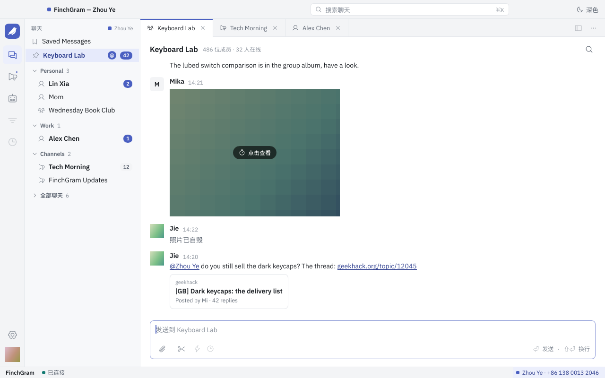

# FinchGram

[English](../README.md) · **简体中文** · [繁體中文](zh-Hant.md) · [Español](es.md) · [Português](pt.md) · [Deutsch](de.md) · [Français](fr.md) · [Русский](ru.md) · [日本語](ja.md) · [한국어](ko.md) · [العربية](ar.md)

<p align="center"></p>

**一个带媒体中心的 Telegram 桌面客户端，用 Rust 和 [Slint](https://slint.dev) 编写。** 开源，GPL-3.0 许可证。
现在支持 Apple silicon 的 macOS，Windows 和 Linux 以后做。

FinchGram 通过 Telegram 官方的库 [TDLib](https://core.telegram.org/tdlib) 和 Telegram 通信，并遵守
[Telegram API 条款](https://core.telegram.org/api/terms)。它是非官方客户端，不是 Telegram 出品的。

<p align="center"></p>

## 能做什么

- **聊天。** 用手机号、验证码和两步验证密码登录，或者扫二维码登录；也可以注册新账号。聊天列表带 Telegram
  的文件夹、置顶、未读数和 @ 提醒；有搜索框（⌘K）；还有频道视图和机器人视图。
- **消息。** 带格式的文字（粗体、斜体、代码、链接）、回复和转发、照片、视频、GIF、贴纸、文件，以及链接预览卡片。
  在消息上点右键打开它的菜单：回复、编辑、拷贝、拷贝链接、转发、举报、删除，或者选择多条。设为自毁的照片和视频
  打码显示、只能打开一次，和 Telegram 官方应用一样。
- **媒体。** 照片和视频在盖住整个窗口的查看器里打开，可以翻看同一相册的其他图片；视频用从源码构建的 mpv
  播放。聊天允许时可以保存到“下载”。
- **发送。** 照片、视频和文件可以从回形针菜单发送，也可以拖进窗口或直接粘贴。发出去之前先在一张卡片里显示：
  可以加说明文字，按照片发或按文件发，最多十个合成一个相册，私聊里可以设自毁计时器，也可以静默发送。
- **截图。** 输入栏里的剪刀或 ⌘⇧A 会定住屏幕：取一个窗口或拖一个选区，画上方框、椭圆、箭头、画笔、文字和马赛克，
  然后直接发送、复制或保存。和微信一样，每个聊天里都有。
- **聊天菜单。** 静音、置顶、标为已读、放进文件夹；拉黑或取消拉黑对方、举报、退出群组或频道、删除聊天。
- **通知。** 新消息以 macOS 通知提醒，未读数显示在 Dock 图标上；关闭窗口后 FinchGram 留在 Dock 里，也可以住进菜单栏。
- **三套主题。** 工作台、报纸和终端，各有浅色和深色，切换不用重启。
- **设置。** 开机启动、按 Enter 发送、截图快捷键、通知的声音和预览、两步验证、界面语言，还有更新：app 从
  GitHub Releases 自动更新，验证不过的一律不装。
- **语言。** 界面有英文和简体中文；这份 README 有十一种语言。

还没有的：秘密聊天、语音消息和通话、多账号、投票和定时消息、关键词过滤、Windows 和 Linux。见
[接下来做什么](../docs/architecture.zh-Hans.md#现在不做)。

## 下载

从[最新的 release](https://github.com/FinchGram/FinchGram/releases/latest) 下载
`FinchGram-<版本>-macos-arm64.zip`，解压后把 FinchGram 拖进“应用程序”。需要 Apple silicon 的 macOS 12
或更新。app 还没有做公证，所以第一次打开时 macOS 会拦一次：系统设置 → 隐私与安全性 → “仍要打开”。之后它会自动更新。

每个 release 都带 `SHA256SUMS` 和它的 Ed25519 签名。app 装更新之前会先校验这两样；你也可以自己校验，公钥在
[release-signing.pub](../release-signing.pub)。

## 三套主题

| 工作台 | 报纸 | 终端 |
|---|---|---|
|  |  |  |

工作台是默认主题，一个带标签页的工作窗口。报纸读起来像报纸，每个账号有自己的强调色。终端是等宽字体的屏幕，
带命令。每套都有浅色和深色，跟随系统或自己选，在“设置 › 外观”里。

<p align="center"></p>

## 截图工具

<p align="center"></p>

按 ⌘⇧A，或者点回形针旁边的剪刀。屏幕定住，整屏压暗：拖一个选区，选区内不压暗，带放大镜和像素尺寸；
单击一个窗口则整个取下。工具条可以画方框、椭圆、箭头、画笔、文字和马赛克，三种粗细、六种颜色，可以撤销。
点 Done 把图放进发送卡片，可以配上说明文字；⌘C 复制；⌘S 存到“下载”。“设置 › 通用 › 截图”里可以改快捷键，
也可以决定截图时要不要先把 FinchGram 的窗口藏起来。

<p align="center"></p>

## 怎么做的

app 是一个外壳。Telegram 本身交给 TDLib，它作为一个独立程序跑在可执行文件旁边：`finchgram-tdlib`，由本仓库从锁定的
源码构建；外壳只通过 `src/telegram/` 跟它通信，用的是 TDLib 自己的 JSON。视频用同样方式构建的 libmpv 播放。
不从用户的机器上拿任何东西，构建时除了这些锁定并带校验和的产物之外什么也不下载。所有东西都公开：源码、vendor 构建
（`vendor/`）和发布。见 [docs/architecture.zh-Hans.md](../docs/architecture.zh-Hans.md) 和
[docs/conventions.zh-Hans.md](../docs/conventions.zh-Hans.md)。

## Telegram 的规矩

FinchGram 只做 Telegram 官方应用做的事，不做它们禁止的事。消息在你看到时标为已读，对方像在任何 Telegram 应用里一样
能看到你正在输入和在线，频道里的赞助消息照常显示，自毁媒体只能打开一次，来自 Telegram 的内容不会交给任何 AI。
除了 Telegram 和用来更新的 GitHub，什么都不会离开你的机器。

## 开发

目前开发需要 Apple silicon 的 macOS：finchgram-tdlib 暂时只为它构建。Linux 和 Windows 以后再支持。

finchgram-tdlib、libmpv 和界面字体都不进 git：`vendor/tdlib/` 和 `vendor/mpv/` 里只放构建它们的脚本，
字体来自 Google Fonts。clone 之后先把它们拿下来一次：

```sh
scripts/fetch-tdlib.sh    # 把锁定的 finchgram-tdlib release 下载到 vendor/tdlib/bin/ 并校验 SHA-256
scripts/fetch-mpv.sh      # 把锁定的 libmpv release 下载到 vendor/mpv/bin/ 并校验 SHA-256
scripts/fetch-fonts.sh    # 把锁定的界面字体下载到 vendor/fonts/ 并校验 SHA-256
FINCHGRAM_API_ID=… FINCHGRAM_API_HASH=… cargo run
```

- 要修改 finchgram-tdlib 本身时，在本地构建它（几分钟；需要 Xcode 或 Command Line Tools，以及
  `brew install cmake ninja gperf`，都只是构建工具）：

  ```sh
  vendor/tdlib/build.sh && vendor/tdlib/build.sh install
  ```

- `FINCHGRAM_API_ID` 和 `FINCHGRAM_API_HASH`：用你自己的，在 [my.telegram.org](https://my.telegram.org)
  → API development tools 申请。它们在编译时读取，永远不进仓库。没有它们 app 也能启动，会提示没有 API ID。
- `FINCHGRAM_TEST_DC=1 cargo run` 连 Telegram 的测试服务器，那里有单独的账号；app 会为它另外保存一个数据库。
- `cargo test screenshots -- --ignored` 用假数据把每套主题的每个页面（浅色和深色）画成图片，存到
  `target/screenshots/`：不用登录账号也能看界面。

`build.rs` 把 `vendor/tdlib/bin/finchgram-tdlib` 复制到编译出来的可执行文件旁边，所以 `cargo run`
用的和打包后的 app 是完全同一个程序；它还从 `vendor/mpv/bin/` 链接 libmpv 并同样复制过去，`vendor/fonts/`
里的字体编译进可执行文件。缺了任何一样，编译都会直接失败并说明原因。需要 Rust 1.92 或更新。

TDLib 的数据库和下载的文件在 `~/Library/Application Support/FinchGram/tdlib/`，设置在
`~/Library/Application Support/FinchGram/settings.toml`。

## 目录

```
.github/workflows/
  mpv.yml                # 在干净的机器上构建 libmpv；mpv-* tag 发布成 release
  release.yml            # 每次 push 到 main 都构建 app；v* tag 发布成 release
  tdlib.yml              # 在干净的机器上构建 finchgram-tdlib；tdlib-* tag 发布成 release
Cargo.toml
build.rs                 # 编译 ui/app.slint，打包 lang/，把 vendor/tdlib/bin/ 复制到可执行文件旁边
docs/                    # architecture.md、conventions.md、drag-and-drop.md（以及中文版）
  screenshots/           #   README 里的图，来自截图测试（scripts/readme-pictures.sh）
lang/                    # 翻译：lang/<代码>/LC_MESSAGES/finchgram.po，编译进二进制
readme/                  # 这份 README 的其他语言版本
release-signing.pub      # 允许给 release 签名的公钥，编译进 app
scripts/
  bundle.sh              # 构建 dist/FinchGram.app（release 流程跑的就是它）
  fetch-fonts.sh         # 把锁定的界面字体下载到 vendor/fonts/
  fetch-mpv.sh           # 把锁定的 libmpv release 下载到 vendor/mpv/bin/
  fetch-tdlib.sh         # 把锁定的 finchgram-tdlib release 下载到 vendor/tdlib/bin/
  readme-pictures.sh     # 把 README 用的图从 target/screenshots/ 复制到 docs/screenshots/
  release.sh             # 发起一次 release：改版本、打 tag、push，其余交给 GitHub Actions
src/
  main.rs                # 窗口、设置、语言和主题、更新；启动 Telegram
  fonts.rs               # 界面字体，编译进可执行文件
  images.rs              # 消息里的图片，在界面线程之外解码
  telegram/              # 唯一跟 finchgram-tdlib 打交道的代码
    process.rs           #   运行这个程序：通过标准输入输出传递 TDLib 的 JSON
    api.rs               #   FinchGram 用到的 TDLib 类型（照锁定版本的 td_api.tl 写）
    mod.rs               #   请求和回复、重新启动；更新交给 store
    store.rs             #   TDLib 告诉我们的聊天、用户和消息；页面用的 model
    login.rs             #   登录、注册
    chats.rs             #   聊天列表
    conversation.rs      #   打开的聊天：消息、发送
    actions.rs           #   消息操作：右键菜单、回复、转发等
    account.rs           #   个人资料、退出登录
    password.rs          #   设置里的两步验证
    files.rs             #   下载文件
    avatars.rs           #   聊天和联系人的头像，代替首字母色块
    viewer.rs            #   媒体查看器：照片、视频、保存到“下载”
    rich_text.rs         #   带格式的文字：粗体、斜体、链接……
    notifications.rs     #   新消息通知、Dock 图标上的未读数
    online.rs            #   窗口在前台、有人在用时，账号是在线状态
  platform/              # 随操作系统而不同的部分
  player/                # 用 libmpv 播放视频，经 OpenGL 画进窗口
  screenshot/            # 截图工具：截取、覆盖层、标注、成图
  update.rs              # 自动更新：GitHub Releases、校验签名、替换、重启
  settings.rs            # 用户偏好（settings.toml）
  i18n.rs                # 界面语言：保存的选择，否则跟系统，否则英文
  screenshots.rs         # 把每个页面画成 PNG（cargo test screenshots -- --ignored）
  bin/                   # finchgram-release-sign.rs，release 背后的 Ed25519 签名工具
ui/
  app.slint              # 主窗口：菜单，以及显示哪个页面
  state.slint            # app 的状态，Rust 和页面共用
  telegram.slint         # Telegram 的内容：账号、登录、聊天、消息
  look.slint             # 当前主题的颜色、字体和形状，给共用页面用
  format.slint           # 按界面语言写出的日期、数量和消息类型
  widgets.slint          # 共用的小部件；chat.slint 是聊天窗口共用的部分
  viewer.slint           # 覆盖整个窗口的媒体查看器，三套主题各有样式
  pages/                 # 三套主题共用的页面：登录、设置、个人资料
  workbench/             # 工作台主题的聊天窗口（默认）
  broadsheet/            # 报纸主题的聊天窗口
  terminal/              # 终端主题的聊天窗口
  icons/                 # Phosphor 图标（MIT），常规和双色两种；icons.slint 列出它们
  logo/                  # FinchGram 的 logo（svg、png）和使用规则
vendor/fonts/            # 不进 git：界面字体（scripts/fetch-fonts.sh）
vendor/mpv/              # libmpv：mpv 和 FFmpeg，用来播放视频
  build.sh               #   从锁定的源码构建它：版本和 SHA-256 都锁定在脚本顶部
  bin/                   #   不进 git：库本身（scripts/fetch-mpv.sh 下载，或 build.sh install）
vendor/tdlib/            # finchgram-tdlib
  build.sh               #   从锁定的源码构建它：TDLib commit、OpenSSL 版本和 SHA-256 都锁定在脚本顶部
  host/                  #   我们的小外壳程序（main.cpp）和它的 CMakeLists.txt
  bin/                   #   不进 git：app 用的程序（scripts/fetch-tdlib.sh 下载，或 build.sh install）
  work/, dist/           #   不进 git：本地构建的中间文件和打好的包
```

## 翻译

界面上的每一段文字都写成 `@tr("English text")`。同一个字符串在哪里出现都只有一个译法（build.rs 关掉了
Slint 的默认 context）；同一句英文在别处需要不同的译法时，给它一个 context：`@tr("menu" => "Open")`。
用官方工具提取，再合并进每种语言：

```sh
cargo install slint-tr-extractor                                          # 装一次
find ui -name '*.slint' | sort | xargs slint-tr-extractor --no-default-translation-context -o lang/finchgram.pot
for po in lang/*/LC_MESSAGES/finchgram.po; do msgmerge --update "$po" lang/finchgram.pot; done   # 需要 brew install gettext
```

然后填好 `msgstr`，重新 `cargo build`。英文是源语言；现在带简体中文。

## 发布

release 只由 GitHub Actions 在干净的机器上、从打了 tag 的 commit 构建（`.github/workflows/release.yml`），
发布在本仓库里：压缩好的 app、`SHA256SUMS` 和它的 Ed25519 签名。已安装的 app 从这里自动更新，
验证不过的一律不装。维护者用一条命令发起 release：

```sh
scripts/release.sh patch    # 0.1.0 -> 0.1.1；也可以是 minor、major 或一个具体版本号
```

app 用项目自己的证书签名，不是 Apple Developer ID，所以下载的 app 第一次打开时，macOS 会拦一次
（系统设置 → 隐私与安全性 → “仍要打开”）。app 自己安装的更新不需要这一步。

## 参与

欢迎提 issue 和 pull request。改动东西之间的关系之前，先读 [docs/architecture.zh-Hans.md](../docs/architecture.zh-Hans.md)
和 [docs/conventions.zh-Hans.md](../docs/conventions.zh-Hans.md)：每个依赖都由本仓库从锁定的源码构建，界面在三套主题里
都照设计稿做，app 里没有任何违反 Telegram API 条款的东西。保持 `cargo test`、`cargo clippy --all-targets` 和
`cargo test screenshots -- --ignored` 干净，并且看一眼画出来的图。README 里的图也来自这个测试：
`scripts/readme-pictures.sh` 会刷新 `docs/screenshots/`。

## 许可证

GPL-3.0（[LICENSE](../LICENSE)）。finchgram-tdlib 包含 TDLib（Boost Software License 1.0）和
OpenSSL（Apache License 2.0）；界面字体采用 SIL Open Font License 1.1，图标采用 MIT 许可证。
它们的许可证文本都随 app 一起分发。
